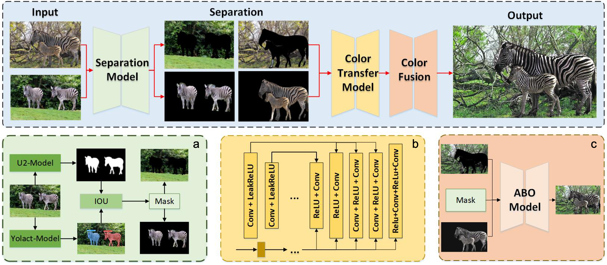
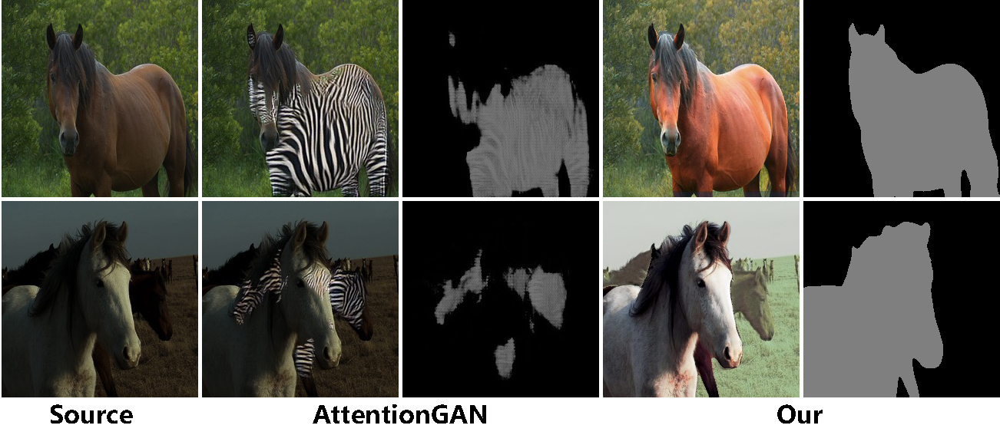

# SCTNet (TIP 2024 accepted) 
Saliency Guided Deep Neural Network for Color Transfer with Light Optimization | [paper](https://github.com/PlanktonQAQ/SCTNet) |

 [Yuming Fang](http://sim.jxufe.cn/JDMKL/ymfang_EN.html), Pengwei yuan, [Chenlei Lv](https://aliexken.github.io)\*, Chen Peng, [Jiebin Yan](https://github.com/QTJiebin), [Weisi Lin](https://personal.ntu.edu.sg/wslin/Home.html)
Color transfer aims to change the color information of the target image according to the reference one. Many studies propose color transfer methods by analysis of color distribution and semantic relevance, which do not take the perceptual characteristics for visual quality into consideration. In this study, we propose a novel color transfer method based on the saliency information with brightness optimization. First, a saliency detection module is designed to separate the foreground regions from the background regions for images. Then a dual-branch module is introduced to implement color transfer for images. Finally, a brightness optimization operation is designed during the fusion of foreground and background regions for color transfer. Experimental results show that the proposed method can implement the color transfer for images while keeping the color consistency well. Compared with other existing studies, the proposed method can obtain significant performance improvement. The source code and pre-trained models are available at [https://github.com/PlanktonQAQ/SCTNet](https://github.com/PlanktonQAQ/SCTNet).

The code was written by ChenPeng.  
 

## Getting Started
### Dependency
- PyTorch >= 1.10.1
- Check the environment.yml
```bash
conda env create -f environment.yml
```
### Installation
- Clone this repo:
```bash
git clone https://github.com/PlanktonQAQ/SCTNet.git
cd SCTNet
```
* Pretrained models can be put in the `./checkpoint`  [[OneDrive](https://1drv.ms/f/s!AgWiZzNpMYvcmN8XUkvuuhQKm8GdEg?e=gJ0lX7)|[Google Drive](https://drive.google.com/drive/folders/1n8vmXTWgTFMIJoIlrNsP0D1Dqldn6P2b?usp=sharing)]

- Prepare image dataset
  - Currently there are several example so that you can execute the code as soon as you clone this repo. [[OneDrive](https://1drv.ms/f/s!AgWiZzNpMYvcmN8Yq8Q4YQwdcBLPOQ?e=WEP9ex)|[Google Drive](https://drive.google.com/drive/folders/1Q2I_SJ9ROU3B51aYayhY5RrgRRY-DqGc?usp=sharing)]
  - To make a new dataset with image pairs, Please make sure the images have consistent names. 
- Finally, test the model:
```bash
python Color_transform_eval.py
```

The test results will be saved to `./result` by default.  

### Arguments
* `opt.checkpoints_dir`: FOLDER-PATH-TO-CHECKPOINT
* `content_dir`: FOLDER-PATH-TO-CONTENT-IMAGES
* `style_dir`: FOLDER-PATH-TO-STYLE-IMAGES

### Separation Module
 

### Results
```bash
python Color_transform_eval.py
```
 

## Acknowledgement
* Part of the segmentation code is provided by [Yolact](https://github.com/dbolya/yolact).
* Salience detection code refer to [U2Net](https://github.com/xuebinqin/U-2-Net)

## Citation
If you find this work useful for your research, please cite:
```
Update Later.
```

## Contact
Feel free to contact if there is any question (Pengwei Yuan 1317091982@qq.com).
